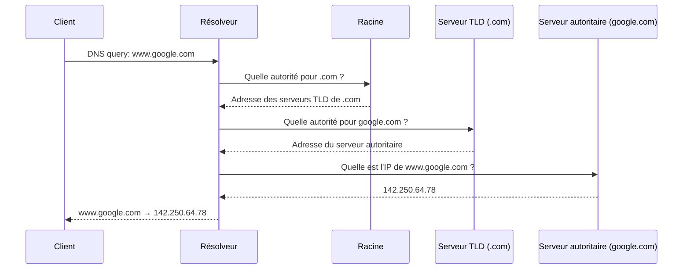

# DNS (Domain Name System)


Les machines communiquent avec des adresses IP. Les humains préfèrent des
noms de domaine lisibles. Plutôt que de taper `142.250.64.78`, on tape `www.google.com`.

### Le DNS est un **annuaire global distribué** qui fait la correspondance :

```

Nom de domaine → Adresse IP
[www.google.com](http://www.google.com) → 142.250.64.78

```

## Structure du système DNS

Le DNS est un **système hiérarchique, distribué et redondant**. Il fonctionne comme un arbre inversé.

Exemple : `www.example.com`

- `.com` → domaine de premier niveau (TLD : Top Level Domain)
- `example.com` → domaine de second niveau
- `www.example.com` → sous-domaine (ou FQDN : Fully Qualified Domain Name)

## Fonctionnement de la résolution DNS

Lorsqu’un client veut contacter `www.example.com` :

1. Il vérifie son **cache local** DNS. Si l'adresse IP est trouvée, il
   l’utilise et le processus s’arrête ici.
2. Sinon, il interroge son **résolveur DNS** (souvent configuré par DHCP).
3. Le résolveur demande aux **serveurs DNS racines** (`.`).
4. Ces derniers renvoient vers le **TLD server** pour `.com`.
5. Le TLD renvoie vers le **serveur DNS faisant autorité** pour `example.com`.
6. Celui-ci répond avec l’**adresse IP** de `www.example.com`.

Le client peut maintenant contacter l’adresse IP retournée. Comme l'illustre le
schéma ci-dessous, c'est le résolveur DNS qui fait le travail de recherche. Le client
n'a pas besoin de connaître la hiérarchie des serveurs DNS.




## Cache DNS

Pour améliorer les performances :
- Chaque réponse DNS est **mise en cache**, avec un **TTL (Time To Live)**.
- Le client ou le résolveur peut **réutiliser la réponse** pendant un certain temps.
- Cela évite de refaire toute la chaîne à chaque fois.


## Serveurs DNS : rôles

| Type de serveur DNS       | Rôle principal                                           |
|---------------------------|----------------------------------------------------------|
| Résolveur (resolver)      | Fait la requête pour le client                          |
| Racine (root servers)     | Point de départ (13 serveurs root mondiaux)             |
| TLD servers (.com, .org)  | Gèrent les domaines de 1er niveau                       |
| Autoritaire               | Connaît les enregistrements d’un domaine donné          |

---

## Types d’enregistrements DNS

| Type   | Description                            | Exemple                           |
|--------|----------------------------------------|-----------------------------------|
| A      | Adresse IPv4                          | `example.com → 93.184.216.34`     |
| AAAA   | Adresse IPv6                          | `example.com → 2606:2800:...`     |
| MX     | Serveur de messagerie                 | `gmail.com → mail.gmail.com`      |
| CNAME  | Alias d’un autre nom                  | `www → example.com`               |
| NS     | Serveurs DNS faisant autorité         | `example.com → ns1.example.net`   |
| TXT    | Informations diverses (ex: SPF)       | Utilisé pour l’authentification   |

---

## Outils de test DNS (Windows)

### `nslookup`

Interroge manuellement un serveur DNS et affiche l’adresse IP associée.

```bash
nslookup www.google.com
```

Pour changer de serveur DNS (google dns : `server 8.8.8.8`).

```bash
nslookup github.com 8.8.8.8
```


### `ping` et `tracert`

* `ping www.google.com` → Résout le nom en IP
* `tracert www.google.com` → Montre le chemin réseau


## Serveurs DNS publics populaires

| Fournisseur | Adresse DNS          | Remarques                |
| ----------- | -------------------- | ------------------------ |
| Google      | `8.8.8.8`, `8.8.4.4` | Rapide, fiable           |
| Cloudflare  | `1.1.1.1`            | Respect de la vie privée |
| OpenDNS     | `208.67.222.222`     | Filtres parentaux        |


## Problèmes fréquents liés au DNS

| Symptôme                               | Cause possible                              |
| -------------------------------------- | ------------------------------------------- |
| Page web inaccessible                  | DNS mal configuré ou non joignable          |
| Résolution DNS lente                   | Serveur distant ou surchargé                |
| Nom de domaine résolu vers mauvaise IP | Problème de cache ou attaque DNS (spoofing) |


## Sécurité et DNS

* Le DNS est historiquement non chiffré.
* De nouvelles méthodes comme **DNS over HTTPS (DoH)** ou **DNSSEC** permettent :

  * Le chiffrement des requêtes.
  * La signature des réponses DNS pour éviter les falsifications.


## Résumé

| Élément              | Rôle                                                    |
| -------------------- | ------------------------------------------------------- |
| DNS                  | Traduit noms en adresses IP                             |
| Résolution récursive | Client → Résolveur → Racine → TLD → Serveur autoritaire |
| Cache                | Améliore les performances (TTL)                         |
| `nslookup`           | Outil de test manuel des résolutions DNS                |
