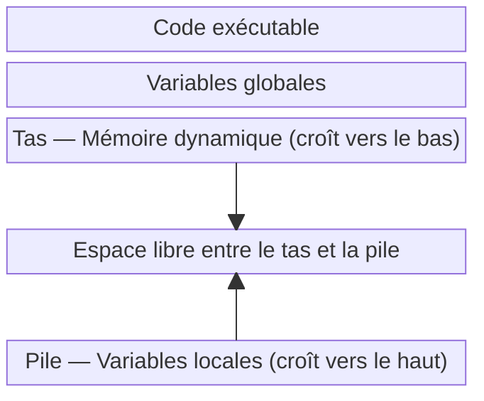

# Application, processus et threads

:::note

Ce cours est basé sur l'excellent livre [Operating Systems: Three Easy
Pieces](https://pages.cs.wisc.edu/~remzi/OSTEP/) de Remzi H. Arpaci-Dusseau et
Andrea C. Arpaci-Dusseau.

:::

## Application et processus

Le terme application est un concept général qui désigne un programme
exécuté par un utilisateur. Ce n'est pas un terme technique précis, mais
il est souvent utilisé pour désigner un programme qui interagit avec
l'utilisateur, comme un éditeur de texte, un navigateur web ou un jeu.

Un processus est une instance d'un programme en cours d'exécution. Il
représente l'environnement d'exécution de l'application, y compris ses ressources
et son état. Un processus est créé lorsqu'une application est lancée et
peut être terminé lorsque l'application se ferme. Un même programme peut être
exécuté plusieurs fois, créant ainsi plusieurs processus distincts.

Plus formellement, au départ un programme n'est qu'un fichier binaire
exécutable stocké sur le disque. Ce fichier binaire contient :

- Le code machine de l'application, qui est le code exécutable par le
  processeur.
- Les données statiques, qui sont des variables globales et constantes
  utilisées par l'application.
- Les ressources nécessaires à l'exécution de l'application, comme les
  bibliothèques partagées et les fichiers de configuration.

Un processus est créé lorsque le système d'exploitation charge le fichier
binaire en mémoire et initialise l'environnement d'exécution. Donc, de façon
imagée, un processus est une copie du programme en mémoire, avec son propre
espace d'adressage, ses propres ressources et son propre état.

### Environnement d'exécution

L'environnement d'exécution d'un processus comprend :
- Un identifiant de processus (PID), qui est un numéro unique
  attribué par le système d'exploitation pour identifier le processus.
- L'espace d'adressage, qui est la mémoire allouée au processus pour
  stocker son code, ses données et sa pile d'exécution.
- Les descripteurs de fichiers, qui sont des références aux fichiers
  ouverts par le processus.
- Les variables d'environnement, qui sont des paires clé-valeur
  utilisées pour configurer le comportement du processus.
- Les signaux, qui sont des notifications envoyées au processus pour
  lui indiquer qu'un événement s'est produit, comme une interruption ou
  une erreur.
- Les threads, qui sont des unités d'exécution légères au sein d'un
  processus. Un processus peut avoir plusieurs threads qui partagent le
  même espace d'adressage et les mêmes ressources, mais qui s'exécutent
  indépendamment les uns des autres.

### Espace d'adressage

Lorsqu'un processus est créé, le système d'exploitation lui alloue un espace
d'adressage, qui est une plage d'adresses mémoire que le processus peut
utiliser pour stocker son code, ses données et sa pile d'exécution. Cet espace
d'adressage est isolé des autres processus, ce qui signifie qu'un processus ne
peut pas accéder directement à la mémoire d'un autre processus.

En fait, du point de vue du programme, ce dernier dispose de la mémoire
entièrement à sa disposition, sans se soucier des autres processus. La mémoire
est divisée en quelques grands segments :

- Le segment de code, qui contient le code exécutable du programme.
- Le segment de données, qui contient les variables globales et les
  structures de données statiques.
- Le segment de pile, qui est utilisé pour stocker les variables locales et
  les paramètres des fonctions.
- Le segment de tas, qui est utilisé pour l'allocation dynamique de mémoire
  (par exemple, avec `malloc` en C ou `new` en C++).

### Partage du CPU

Il est plus que probable que vous ayez beaucoup plus de processus actifs que de 
cœurs de processeur sur votre machine. Il faut donc trouver un moyen de
partager le CPU entre les différents processus de façon transparente pour
l'utilisateur.

L'idée principale est de faire croire à chaque processus qu'il a le CPU
entièrement pour lui. Pour cela, le système d'exploitation utilise un mécanisme
appelé **planification** (ou **scheduling** en anglais). La planification
consiste à attribuer des tranches de temps (ou **quanta**) à chaque processus,
de sorte que chaque processus puisse s'exécuter pendant un certain temps avant
d'être interrompu et de laisser la place à un autre processus.

Lorsqu'un processus est interrompu, son état est sauvegardé dans le système
d'exploitation, de sorte qu'il puisse reprendre son exécution plus tard à
partir du même point. Le système d'exploitation utilise un algorithme de
planification pour décider quel processus doit s'exécuter à un moment donné. Si
vous avez déjà entendu le terme "context switch", c'est exactement ce que cela
signifie : le système d'exploitation sauvegarde l'état du processus actuel et
le restaure plus tard pour reprendre son exécution.

C'est aussi le système d'exploitation qui gère quel processus s'exécute sur quel
cœur de processeur. Il peut déplacer un processus d'un cœur à un autre pour
optimiser l'utilisation des ressources du système. Cela permet de répartir la
charge de travail entre les différents cœurs et d'améliorer les performances
du système.

En tant qu'utilisateur, vous n'avez pas à vous soucier de la planification
des processus, car le système d'exploitation s'en charge automatiquement. Vous
pouvez toutefois influencer la planification en modifiant la priorité des processus ou 
leur affinité (c'est-à-dire le cœur de processeur sur lequel ils doivent s'exécuter).

Sur Windows, vous pouvez utiliser le gestionnaire de tâches (onglet Détails) pour
modifier la priorité d'un processus ou son affinité.

## Processus et threads

Votre système d'exploitation travaille très fort pour isoler les processus les
uns des autres, mais il y a des cas où il est souhaitable qu'un même programme
puisse exécuter plusieurs tâches en parallèle. Il est aussi plus simple parfois
que certaines tâches partagent des ressources, comme la mémoire, plutôt que de
dupliquer ces ressources pour chaque tâche. C'est là qu'interviennent les
**threads**.

Un thread est une unité d'exécution légère au sein d'un processus. Un processus
peut avoir plusieurs threads qui partagent le même espace d'adressage (mémoire)
à l'exception de la pile, mais qui s'exécutent indépendamment les uns des
autres. Donc si vous avez un processus avec plusieurs threads, ces threads
peuvent s'exécuter en parallèle sur plusieurs cœurs de processeur, ce qui
permet d'améliorer les performances du programme. Même sans avoir plusieurs
cœurs de processeur, les threads permettent de mieux utiliser le CPU en
évitant les temps d'attente inutiles, par exemple en attendant une réponse du
réseau ou en effectuant des opérations d'entrée/sortie.

Donc on peut voir un thread comme un processus léger qui partage la mémoire
du processus parent. Il est également pris en charge par la planification du
système d'exploitation. Ainsi, comme les processus, il est généralement
difficile de prédire exactement quand un thread va s'exécuter, car cela dépend
de la planification du système d'exploitation et de la charge de travail
actuelle du système.

### Kernel threads et user threads

De façon un peu mélangeante, il existe un autre concept de thread. En effet, on
peut distinguer les threads gérés par le système d'exploitation (appelés
**kernel threads**) et les threads gérés par l'application (appelés **user
threads**). Les kernel threads sont gérés par le système d'exploitation et sont
planifiés par le noyau. Ils correspondent à la description ci-dessus. Ils
peuvent s'exécuter en parallèle sur plusieurs cœurs de processeur et sont
isolés les uns des autres (sauf pour la mémoire).

Les user threads (green threads, coroutines en Go, fibers en Rust, etc.) sont
gérés par l'application et sont planifiés par l'application elle-même. Ils
sont généralement plus légers que les kernel threads, car ils ne nécessitent pas
de gestion par le système d'exploitation. Cependant, ils ne peuvent pas
s'exécuter en parallèle sur plusieurs cœurs de processeur, car ils sont
planifiés par l'application et non par le système d'exploitation. C'est un peu
comme si le processus découpait lui-même son temps et faisait sa propre planification. Mais tout cela 
à l'intérieur d'un seul processus ou thread.

Certains langages comme [Go](https://go.dev/) mélangent les deux concepts. Ils permettent d'avoir M
coroutines (user threads) qui s'exécutent sur N threads (kernel threads). C'est
l'environnement d'exécution de Go qui gère la planification des coroutines sur les threads. Cela
permet d'avoir une gestion fine des ressources tout en profitant de la
planification du système d'exploitation et du parallélisme multi-cœur.